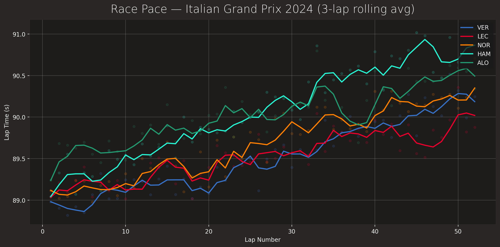
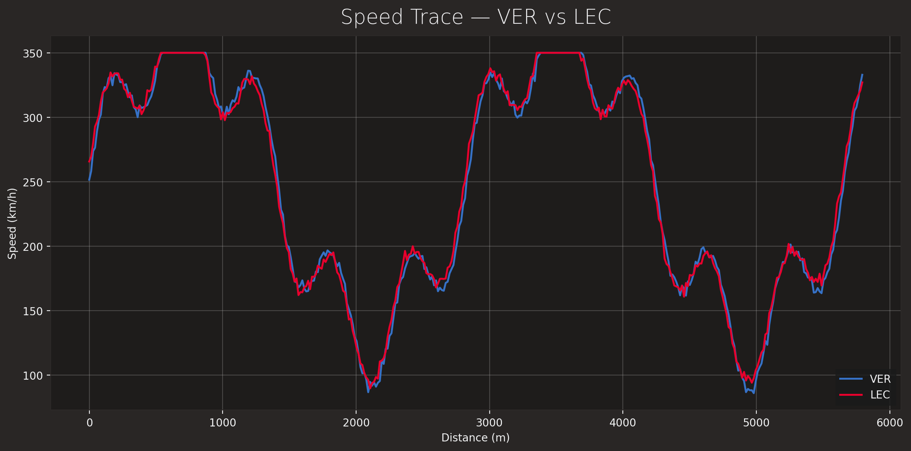
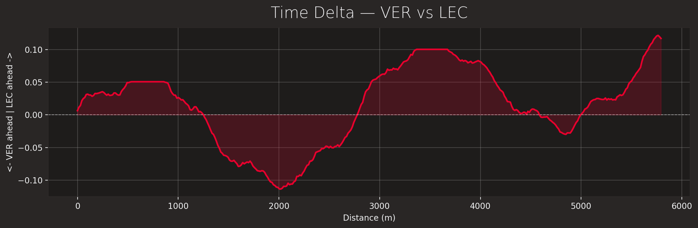
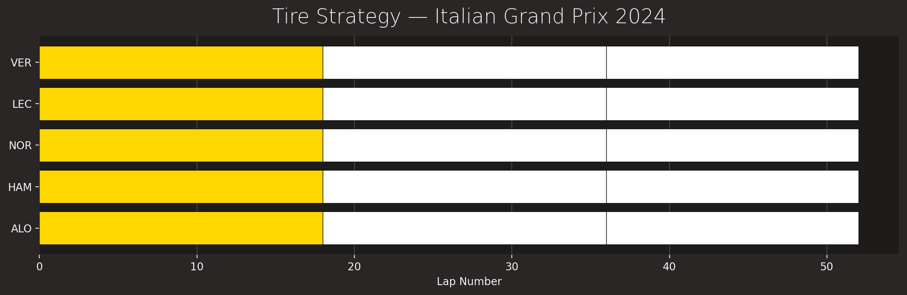
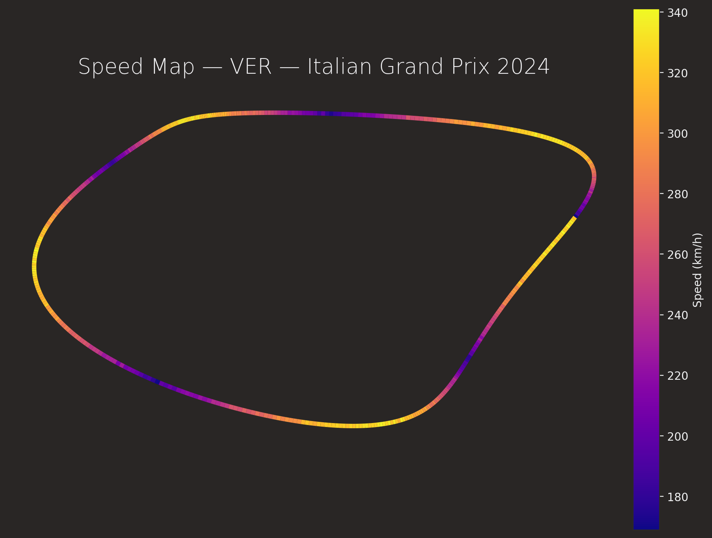

# F1 Telemetry Analysis

A Python toolkit for analyzing Formula 1 telemetry, timing data, and race strategy using the [FastF1](https://github.com/theOehrly/Fast-F1) API — with four machine learning models built on top.



---

## What this does

**Telemetry & session analysis**
- Lap time distributions, race pace consistency, and tire strategy for any session since 2018
- Driver head-to-head telemetry — speed traces, time delta along the lap, throttle and brake overlays
- Track speed maps — the circuit outline colored by speed at every point
- Full race story for a single driver — pit stops, overtakes, positions lost, SC/VSC incidents, sector times, and undercut windows, all in one chart

**Season-level analysis**
- Round-by-round championship progression for drivers and constructors
- Markdown session reports with fastest laps, pace stats, tire strategy, and weather

**Machine learning models (trained on a full season of FastF1 data)**

| Model | Task | Algorithm |
|---|---|---|
| `LapTimePredictor` | Predict lap time in seconds from tire, lap, and weather features | Gradient Boosting Regressor |
| `RaceFinishPredictor` | Classify finish as podium / points / outside points | Random Forest Classifier |
| `TireCompoundClassifier` | Identify tire compound from speed and sector signals alone | Extra Trees Classifier |
| `UndercutDetector` | Flag laps that create undercut windows | Isolation Forest + domain rules |

---

## Project structure

```
f1-telemetry-analysis/
├── f1_analysis/                    # installable package
│   ├── core/
│   │   ├── session_loader.py       # FastF1 session loading + caching
│   │   ├── lap_analysis.py         # lap cleaning, pace stats, stint summaries
│   │   ├── telemetry.py            # per-lap telemetry, driver-vs-driver comparison
│   │   └── season.py               # season schedule + championship standings
│   ├── visualization/
│   │   ├── style.py                # team/driver/compound color helpers
│   │   └── plots.py                # all chart-generating functions
│   ├── ml/
│   │   ├── data_builder.py         # builds season-level training data from FastF1
│   │   ├── lap_time.py             # LapTimePredictor
│   │   ├── race_finish.py          # RaceFinishPredictor
│   │   ├── tire_compound.py        # TireCompoundClassifier
│   │   └── undercut.py             # UndercutDetector
│   └── reports/
│       └── session_report.py       # Markdown report generation
├── scripts/                        # runnable CLI entry points
│   ├── 01_session_deep_dive.py
│   ├── 02_driver_head_to_head.py
│   ├── 03_season_championship.py
│   ├── 04_track_speed_map.py
│   ├── 05_ml_season_models.py      # train all four ML models on a full season
│   ├── 06_single_race_predict.py   # apply trained models to one race
│   └── 07_race_story.py            # full race story for a single driver
├── tests/                          # offline unit tests (no network required)
├── outputs/                        # generated charts/reports land here (gitignored)
├── cache/                          # FastF1 local data cache (gitignored)
└── docs/images/                    # demo images used in this README
```

---

## Installation

Requires **Python 3.9+**.

```bash
git clone https://github.com/Neer0212/f1-telemetry-analysis.git
cd f1-telemetry-analysis
pip install -r requirements.txt
pip install -e .
```

The `-e .` makes the `f1_analysis` package importable from anywhere while you keep editing the source.

---

## Quick start

```python
from f1_analysis.core.session_loader import load_session
from f1_analysis.core.lap_analysis import clean_lap_times, fastest_laps_by_driver
from f1_analysis.visualization.style import apply_f1_style
from f1_analysis.visualization.plots import plot_race_pace

apply_f1_style()

session = load_session(2024, "Monza", "R")           # year, Grand Prix, session
clean = clean_lap_times(session.laps)                 # drop pit/inaccurate laps
print(fastest_laps_by_driver(clean).head())

fig = plot_race_pace(session, ["VER", "LEC", "NOR"])
fig.savefig("race_pace.png")
```

The first time you load a session, FastF1 downloads and caches it under `cache/`. Every subsequent load of the same session is fast and works offline.

---

## Scripts

All outputs land in `outputs/charts/` and `outputs/reports/`. Run any script with `--help` to see all available options.

### 01 — Session deep dive
Fastest laps, race pace, tire strategy, and a Markdown report for any session.

```bash
python scripts/01_session_deep_dive.py --year 2024 --gp Monza --session R
python scripts/01_session_deep_dive.py --year 2023 --gp "Abu Dhabi" --session Q --drivers VER LEC HAM
```

### 02 — Driver head-to-head
Speed trace overlay, cumulative time delta, and throttle/brake comparison for two drivers' laps.

```bash
python scripts/02_driver_head_to_head.py --year 2024 --gp Monza --session Q --driver-a VER --driver-b LEC
```

### 03 — Season championship
Round-by-round standings progression for drivers and constructors across a full season.

```bash
python scripts/03_season_championship.py --year 2024
python scripts/03_season_championship.py --year 2023 --top-n 5 --up-to-round 15
```

### 04 — Track speed map
Circuit outline colored by the driver's speed at every point on track.

```bash
python scripts/04_track_speed_map.py --year 2024 --gp Monaco --session Q --driver LEC
python scripts/04_track_speed_map.py --year 2024 --gp Spa --session R --driver VER --lap 10
```

### 05 — ML season models *(run this first)*
Downloads every race of a season, builds a training dataset, and trains all four ML models. Saves the season CSV and trained models to disk so script 06 is fast.

```bash
python scripts/05_ml_season_models.py --year 2024 --driver VER
python scripts/05_ml_season_models.py --year 2024 --driver NOR --max-rounds 15
# Skip re-downloading if you already have the CSV:
python scripts/05_ml_season_models.py --year 2024 --driver LEC --load-data outputs/reports/season_2024_laps.csv
```

> **Note:** First run downloads data for every race of the season — this takes several minutes. After that it's cached locally.

### 06 — Single race prediction
Applies models trained by script 05 to one specific race and shows predictions vs. actual results.

```bash
python scripts/06_single_race_predict.py --year 2024 --driver VER --gp "Abu Dhabi"
python scripts/06_single_race_predict.py --year 2024 --driver NOR --gp Silverstone
```

### 07 — Race story
A complete lap-by-lap story for one driver: pit stops, overtakes, positions lost, SC/VSC incidents, sector times, top speed, undercut windows — printed to the terminal and saved as a single combined chart.

```bash
python scripts/07_race_story.py --year 2024 --gp Monaco --driver LEC
python scripts/07_race_story.py --year 2024 --gp "Abu Dhabi" --driver VER
```

---

## Example output

| Speed trace comparison | Time delta |
|---|---|
|  |  |

| Tire strategy | Speed map |
|---|---|
|  |  |

---

## ML models — how they work

All four models are trained on a season-level DataFrame built by `SeasonDataBuilder`, which iterates over each race of the season and assembles per-lap features: tire compound and age, lap number, race fraction, speed trap readings, sector times, and weather conditions.

**LapTimePredictor** — Gradient Boosting Regressor that predicts how long a lap should take given compound, tire age, and conditions. Residuals from this model reveal unusual laps (safety cars, errors, traffic) and quantify tire degradation.

**RaceFinishPredictor** — Random Forest Classifier that predicts whether a driver will finish on the podium, in the points, or outside the points based on their current situation mid-race.

**TireCompoundClassifier** — Extra Trees Classifier that infers which tire compound a driver is running from speed and sector signals alone, without using the compound label. Useful for verifying FastF1 compound data and understanding what signals actually distinguish soft from hard tires.

**UndercutDetector** — Two-stage detector: Isolation Forest flags laps that are anomalously fast relative to expected pace for that compound and tire age, then domain rules (stint length, SC suppression) convert the anomaly score into an `UndercutScore` (0–1) and a `WindowOpen` boolean flag.

---

## Running tests

```bash
pip install -r requirements-dev.txt
pytest
```

Tests run fully offline against synthetic hand-built data — no network or FastF1 downloads required.

---

## Data source

Built on [FastF1](https://docs.fastf1.dev/), which sources data from F1's live timing feed (lap times, car telemetry, weather) and the Ergast API (historical results, standings). Data is available from the **2018 season onward**; telemetry detail and availability can vary for older sessions.

---

## Notes and limitations

- The `delta_time` calculation in head-to-head comparisons is a useful approximation but isn't millisecond-precise — treat it as directionally accurate.
- Two teammates share the same team color; plots use `get_driver_style` (color + line style) rather than color alone to keep them visually distinguishable.
- Season championship scripts make one API call per round (~20+ requests for a full season). Results are cached to CSV so you only pay that cost once.
- ML models are trained on one driver's laps from one season — predictions are most meaningful for that driver/season combination. Cross-season or cross-driver generalization will vary.

---

## License

MIT — see [LICENSE](LICENSE).